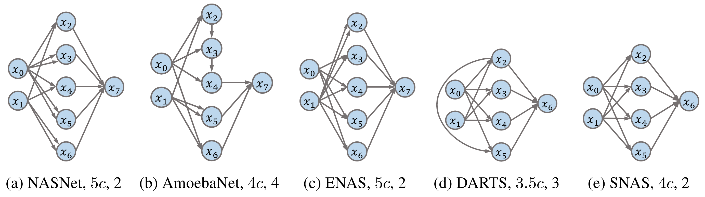

# DARTS-Genotype-Analysis


This repository contains the genotype analysis especially the depth and width defined in the paper [**Understanding Architectures Learnt by Cell-based Neural Architecture Search**](https://openreview.net/forum?id=BJxH22EKPS) by [Yao Shu](https://openreview.net/profile?email=shuyao%40comp.nus.edu.sg)*,* [Wei Wang](https://openreview.net/profile?email=wangwei%40comp.nus.edu.sg)*,* [Shaofeng Cai](https://openreview.net/profile?email=shaofeng%40comp.nus.edu.sg). At the same time, in order to better understand the cell structure, statistics on the number of operations in the cell structure are also added.

> The depth of a cell is defined as the number of connections along the longest path from input nodes to the output node. The width of a cell is defined as the total width of the intermediate nodes that are connected to the input nodes.



## Requirements

```shell
pip install networkx
```

## Usage

```python
python main.py
```

## Reference
https://github.com/quark0/darts

https://github.com/shuyao95/Understanding-NAS

## Citation

```
@inproceedings{
    shu2020understanding,
    title={Understanding Architectures Learnt by Cell-based Neural Architecture Search},
    author={Yao Shu and Wei Wang and Shaofeng Cai},
    booktitle={International Conference on Learning Representations},
    year={2020},
    url={https://openreview.net/forum?id=BJxH22EKPS}
}
```